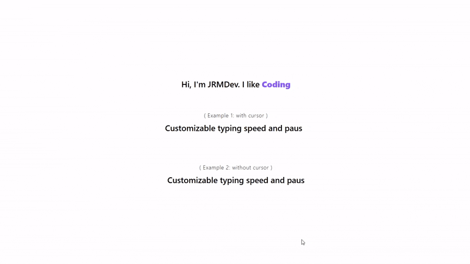

# TypingText ✨

A lightweight, customizable **typing text animation component for React**. Perfect for hero sections, landing pages, portfolios, and dynamic UI text.

---

## ✨ Features

- 🖋 Smooth typing and deleting animation
- ⚡ Adjustable typing speed, deleting speed, and pause duration
- 👀 Optional blinking cursor
- 🎨 Fully customizable styles via `className`
- 🪶 Lightweight and easy to integrate

---

## 📦 Installation

```bash
npm install @jralphm_dev/react-typing-text
```

---

## 🚀 Usage

```tsx
import TypingText from '@jralphdev/react-typing-text';

export default function App() {
  const demoText = [
    'Smooth typing animation for React applications.',
    'Lightweight and easy to integrate.',
    'Customizable typing speed and pause settings.',
    'Enhances user interfaces with dynamic text.',
  ];

  return (
    <div className='flex items-center justify-center h-screen text-center'>
      <TypingText
        words={demoText}
        typeSpeed={50}
        deleteSpeed={50}
        pauseDelay={3000}
        showCursor={true}
        className='text-2xl font-semibold'
      />
    </div>
  );
}
```

---

## 📷 Preview

<p align="center">
  
</p>

---

## 🧠 Props

| Prop          | Type                                  | Default | Description                                |
| ------------- | ------------------------------------- | ------- | ------------------------------------------ |
| `words`       | `readonly string[]`                   | —       | List of words to type (required)           |
| `typeSpeed`   | `number`                              | `50`    | Typing speed (ms per character)            |
| `deleteSpeed` | `number`                              | `50`    | Deleting speed (ms per character)          |
| `pauseDelay`  | `number`                              | `3000`  | Pause before deleting (ms)                 |
| `showCursor`  | `boolean`                             | `true`  | Show or hide the blinking cursor           |
| `className`   | `ComponentProps<'span'>['className']` | —       | Tailwind or custom CSS classes for styling |

---

## 📄 License

[MIT License](./LICENCE)

---

Created by **JRMDev**

If you find this useful, consider giving it a ⭐ on GitHub!
